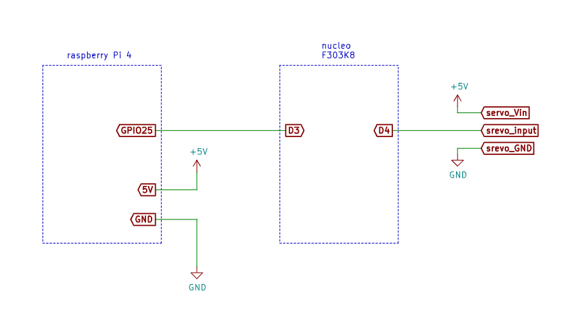
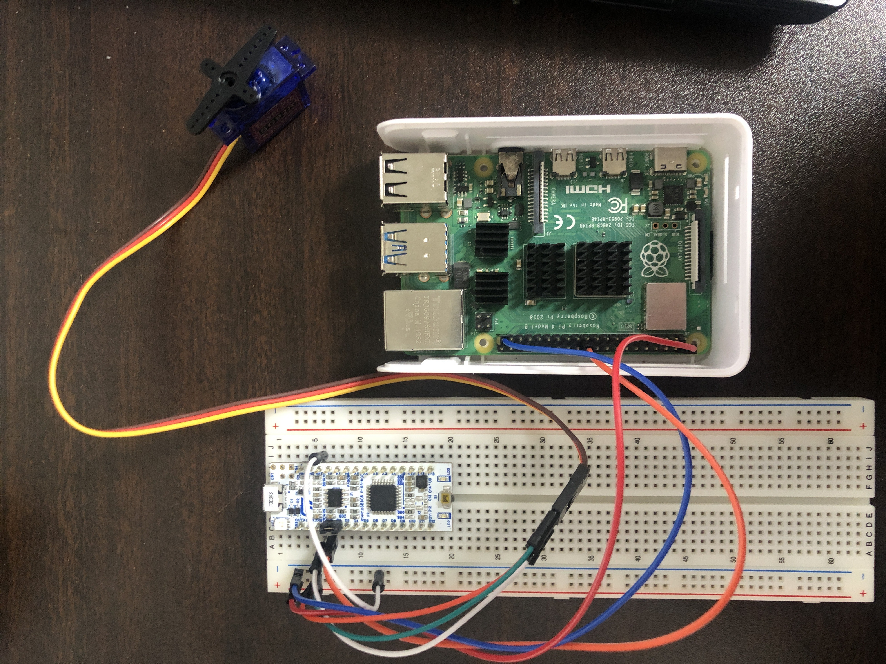

# robosys2021_homework1
## 概要
Raspberry Pi4 ModelB 4GBを使って、入力された文字からサーボモータを動かすデバイスドライバを作成しました。

## 回路構成

### 部品

- RaspberryPi4
- NUCLEO-F303K8
- マイクロサーボ　ＳＧ９２Ｒ
- ブレッドボード
- ジャンパ線(オス×オス)：6個

### 回路図



### 実際に取り付けた画像



## 応用編で必要なもの
- ケージ
- ペットボトルキャップ
- テープ
- ハムスター
- ハムスター用の餌
- 受け皿

## 使用方法
### Mbedの用意
~Mbedのアカウントが作成されていることを前提としています~

- https://os.mbed.com/users/nikuman/code/RS1/ をクリックして、**Import into Compiler**を選択
- Importしたら、マイプログラムにRS1ファイルが作成されていることを確認
- Select a Platformは**NUCLEO-F303K8**を選択
- コンパイルして書き込む

### git cloneから実行まで

```
git clone https://github.com/MakiSakurai/robosys2021_homework1.git
cd robosys2021_homework1/homework1
make
sudo insmod homework1.ko
sudo chmod 666 /dev/homework10
```
次のコマンドを実行するとサーボモータが回転し、戻ります
```
echo e > /dev/homework0
```
次のコマンドを実行すると、サーボモータが回転と戻る動きを数回繰り返します。
```
echo n > /dev/homework0
```

プログラムの内容を変更したりする際に、もう一度sudo insmod homework1.koする場合は、次を実行してからsudo insmod homework1.koを実行してください。

```
sudo rmmod homework1
```

### 実際に動かしている様子
https://youtu.be/EcZV0k68OHs
